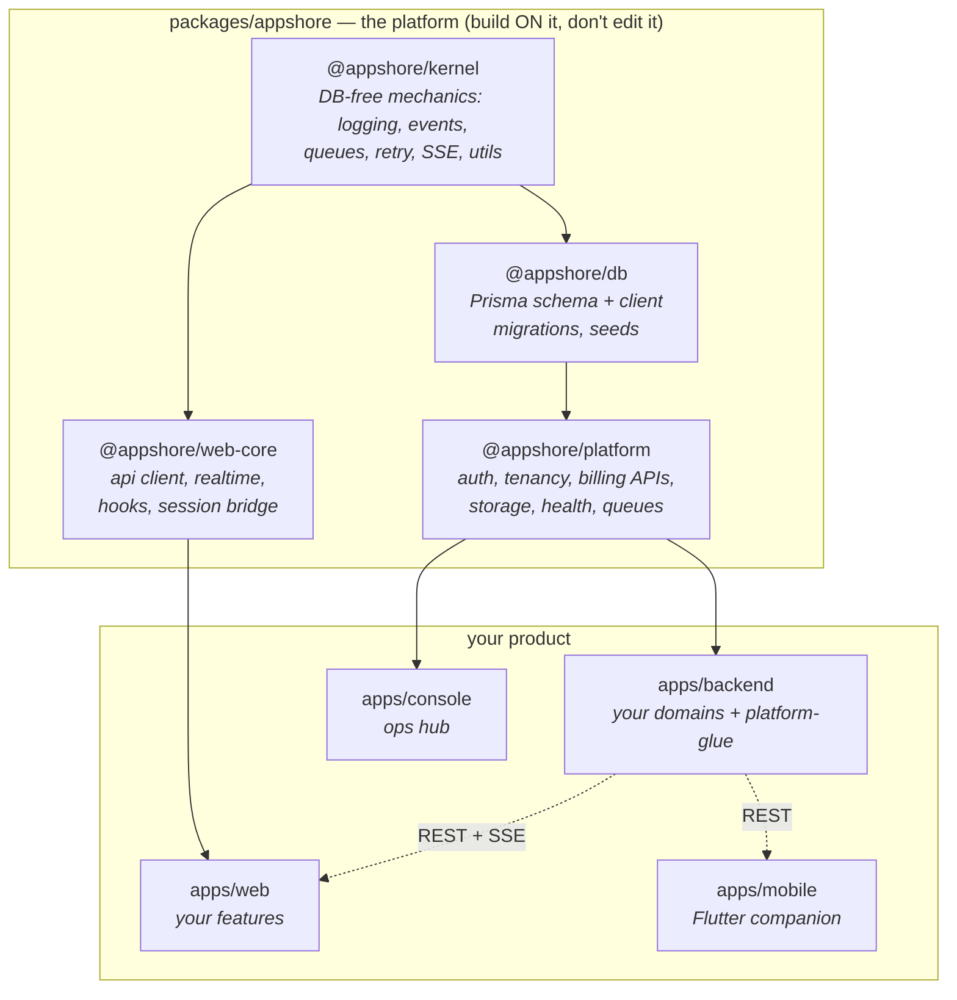
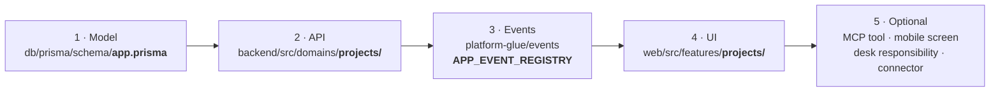

# AppShore Platform Starter

**A production-grade, full-stack SaaS starter with the hard parts already built** — auth,
four tenancy models, billing, a working AI assistant, background jobs, realtime, and cloud
infrastructure — so you only write the code that makes your product _your product_.

[](LICENSE)
[](CONTRIBUTING.md)

There is deliberately **no business logic in here** — no "orders", no "projects", no
"patients". That empty space is where your app goes. Everything cross-cutting works on
day one and is covered by ~2,250 unit tests plus a generated RBAC matrix over every
endpoint.

> **Start a new project:** click **"Use this template"** on GitHub (or fork), then follow
> the quickstart below. One command renames everything to your product.

---

## What you get on day one

- 🔐 **Auth that just works** — email+password out of the box (zero external services),
  phone OTP/PIN, optional Firebase; JWT + rotating refresh tokens; full **OAuth 2.1
  provider** (PKCE) so MCP clients like Claude can "Sign in with _your app_".
- 🏢 **Four tenancy models, one env var** — classic multi-tenant, Slack-style
  workspaces (one user ↔ many workspaces with a role in each), dedicated single-tenant,
  or consumer-style personal workspaces. Same code, same queries.
- 🤖 **A working AI product surface** — streaming assistant (Anthropic + AI SDK + Mastra),
  RAG knowledge base (pgvector), per-tenant AI budgets, human-in-the-loop approvals, an
  **MCP server** with sample tools, and a durable agent workflow engine (Inngest).
- 💳 **Plans & billing** — entitlements enforced in the guard chain, Stripe
  subscriptions/invoices, credit wallet, trials, dunning.
- 🧰 **The plumbing** — BullMQ jobs with dead-letter handling, typed domain events → SSE
  realtime + outbound webhooks, multi-channel notifications (in-app/push/SMS/email), S3
  file storage, OpenTelemetry + Grafana stack, health endpoints.
- 📱 **Four apps** — NestJS API, Next.js product app, Next.js admin console, and a
  Flutter mobile companion.
- 🚀 **Delivery** — docker-compose dev stack, Terraform for AWS (ECS/RDS/ElastiCache),
  GitHub Actions CI, Playwright QA suite that runs on a fresh clone.

The full inventory — including the default Postgres schema, what needs an API key, and
exactly what you build — lives in **[docs/WHAT-YOU-GET.md](docs/WHAT-YOU-GET.md)**.

---

## Quickstart (5 minutes to a working login)

```bash
git clone <your-repo> my-app && cd my-app
pnpm install
pnpm init-app          # prompts: name, display name, tenancy mode, keep mobile app?
pnpm docker:up         # Postgres 16 (pgvector) + Redis 7

cd apps/backend && cp .env.example .env && cd ../..
cp apps/web/.env.example apps/web/.env.local

pnpm backend:prisma:generate
cd apps/backend && pnpm prisma:migrate:deploy && pnpm db:seed && cd ../..
pnpm dev               # backend :8000 · web :3000 · console :3002
```

The seed prints **ready-to-use dev credentials** (non-production only):

| Who                  | Email               | Password       |
| -------------------- | ------------------- | -------------- |
| Workspace owner      | `owner@example.com` | `Password123!` |
| Platform super admin | `admin@example.com` | `Password123!` |

Open `http://localhost:3000/login` and you're inside a live workspace — the seeded owner
even belongs to **two** workspaces so you can try the workspace switcher immediately.

---

## Architecture: the platform vs. your app

The reusable foundation lives in versioned `@appshore/*` packages. The dependency
direction is enforced by a CI test — platform packages can never import your code:



Where the platform needs _app_ behavior (a user joined, a tenant was approved), it
exposes a **hook token** and your app binds the implementation — the platform stays
app-blind.

### Where your code goes

Adding a feature ("projects", say) touches exactly these extension points — everything
around them (auth, tenant scoping, rate limits, plan gating, realtime, observability) is
already handled:



---

## Tenancy: four models, one switch

| Model                      | `TENANCY_MODE`     | What you get                                                                           |
| -------------------------- | ------------------ | -------------------------------------------------------------------------------------- |
| **Multi-tenant** (default) | `multi`            | Orgs share the app: subdomain tenants, self-registration + admin approval              |
| **Workspace-based**        | `multi` (built in) | Slack/Notion style: users belong to many workspaces, role per workspace, live switcher |
| **Single-tenant**          | `single`           | One implicit workspace; deploy a dedicated stack per customer                          |
| **User-centric**           | `personal`         | Consumer style: simple signup auto-creates a private workspace per user                |

Your domain code is identical in all four — every query is `where: { tenantId }` and the
guard chain (`Throttler → Jwt → Tenant → Roles → Plan`) decides what that means.

---

## Tech stack

| Layer    | Tech                                                                                          |
| -------- | --------------------------------------------------------------------------------------------- |
| Backend  | NestJS 11 · TypeScript 5.9 · Prisma 7 · PostgreSQL 16 (pgvector) · Redis 7 · BullMQ · Inngest |
| Frontend | Next.js 15 (App Router) · Tailwind · shadcn/ui · TanStack Query · Zustand                     |
| Mobile   | Flutter 3                                                                                     |
| AI       | Anthropic · AI SDK · Mastra · MCP · Langfuse                                                  |
| Infra    | Docker Compose (dev) · Terraform + AWS ECS (prod) · Loki/Tempo/Grafana                        |

---

## Learn more

- **[What you get & what you build](docs/WHAT-YOU-GET.md)** — start here: full feature
  inventory, default schema, and the step-by-step path to your first domain.
- **[CLAUDE.md](CLAUDE.md)** — conventions, domain map, and AI-assistant context (this
  repo is optimized for AI-assisted development).
- **[Architecture decision records](docs/superpowers/specs/)** — why things are the way
  they are.
- **[init-app](tools/init-app/README.md)** — the one-command rename tool.
- **[Doppler secrets guide](docs/doppler.md)** — production-grade env management.

## Contributing & license

PRs welcome — see [CONTRIBUTING.md](CONTRIBUTING.md). Licensed under
[MIT](LICENSE) © Appshore LLP.
