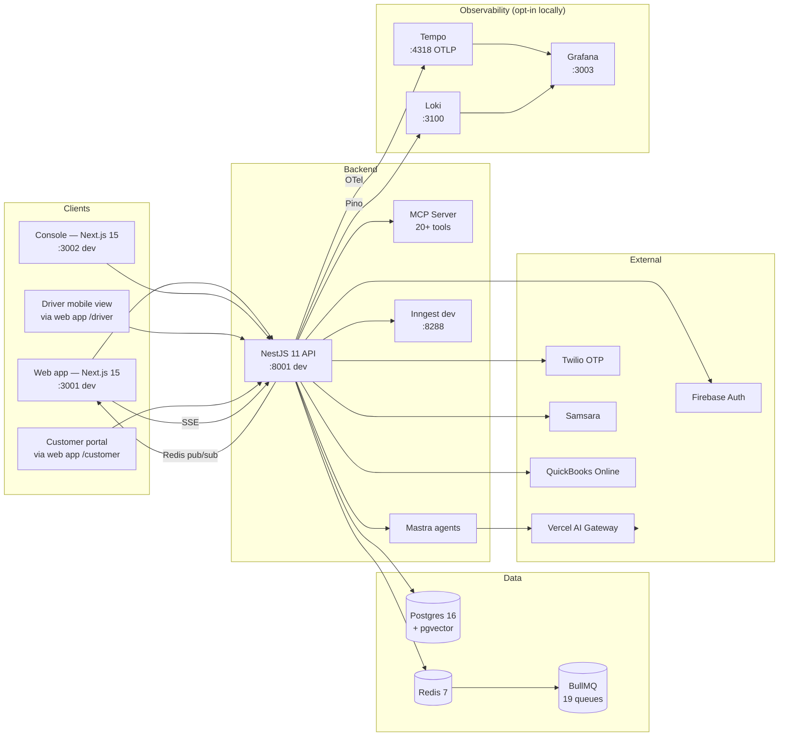

# System Overview

SALLY is an AI-native fleet operations platform: core TMS (drivers, vehicles, loads, invoicing, settlements, close-out) plus Sally AI assistant, document intelligence, Shield compliance, command center, route planning with HOS compliance, and integrations (Samsara, QuickBooks, EDI).

## Services map

## Request lifecycle (typical)

1. Browser sends a request to the NestJS API with a Firebase-issued JWT.
2. **AuthGuard** verifies the JWT and resolves the `User`.
3. **Tenant context middleware** resolves the active tenant from the user; subsequent Prisma queries are tenant-scoped.
4. The controller validates the request body against a Zod-derived DTO and calls the service layer.
5. The service does work against Postgres (Prisma) and Redis (cache + queues) and may emit `DomainEvent`s.
6. `DomainEvent`s flow to:
    - Wildcard subscribers (in-process, used by SSE bridge).
    - Persistence subscriber (logs to `DomainEventLog`).
    - Durable subscribers (BullMQ — replayed on failure).
7. Response goes back as `camelCase` JSON.
8. If listeners exist, an SSE message arrives at the browser shortly after; TanStack Query invalidates the relevant cache keys.

## Multi-tenancy

- Every domain entity has a `tenant_id` column.
- Controllers extend `BaseTenantController` (NestJS), which exposes the resolved tenant ID to handlers.
- Prisma queries always filter by `tenant_id`. RLS (row-level security) is also enforced at the database for AI-driven reads — see the `ai/rls/` sub-domain.
- Authorization is role-based: `DISPATCHER`, `DRIVER`, `ADMIN`, `CUSTOMER`, `SUPER_ADMIN`. The role matrix is tested in the QA RBAC suite (`tests/rbac/`).

## Services in dev

| Service | Port | How it starts | Notes |
|---|---|---|---|
| Web app | `:3001` | `pnpm doppler:frontend` | Next.js 15 App Router |
| Console | `:3002` | `pnpm doppler:console` | Platform / API-docs hub |
| Backend API | `:8001` | `pnpm doppler:backend` | NestJS 11, Doppler-injected `PORT` |
| Postgres | `:5432` | `docker-compose up -d` | Default profile |
| Redis | `:6379` | `docker-compose up -d` | Default profile |
| Inngest | `:8288` | `docker-compose up -d` | Desk durable workflow engine |
| Grafana | `:3003` | `docker-compose --profile observability up -d` | Opt-in |
| Tempo OTLP | `:4317` / `:4318` | observability profile | Trace ingest |
| Loki | `:3100` | observability profile | Log ingest |
| Prisma Studio | (varies) | `cd apps/backend && doppler run -- pnpm prisma:studio` | |

## Tech-stack table

| Layer | Tech | Version | Notes |
|---|---|---|---|
| Backend framework | NestJS | 11 | TypeScript 5.9 |
| ORM | Prisma | 7.3 | Schema at `apps/backend/prisma/schema.prisma` |
| Database | Postgres | 16 (with pgvector extension) | `pgvector/pgvector:pg16` image |
| Cache + queues | Redis | 7 | BullMQ on top, 19 named queues |
| Frontend framework | Next.js | 15.1 | App Router |
| UI | React 18 + Tailwind 3 + Shadcn (via `@sally/ui`) | | |
| Data fetching | TanStack Query | 5.62 | |
| Client state | Zustand | 5.0 | |
| Auth | Firebase Authentication | 12.8 | + JWT on the backend |
| AI primitives | Vercel AI SDK | 6 | `generateText`, `streamText`, `generateObject` |
| AI agents | Mastra | 1.4 | Agents identified by string keys (`sally-billing`, `sally-alert-briefing`, …) |
| AI provider routing | Vercel AI Gateway | — | Configured in `apps/backend/src/domains/ai/infrastructure/providers/ai-provider.ts` |
| Durable workflows | Inngest | 4.2 | Used by Sally's Desk |
| Logging | Pino | 10.3 | Pino-Loki transport optional |
| Tracing | OpenTelemetry | — | OTLP HTTP → Tempo |
| Test (backend) | Jest | 30.2 | TDD per CLAUDE.md |
| Test (cross-cutting) | Playwright | — | `tests/` workspace, `@sally/qa` |
| Monorepo | Turborepo + pnpm | turbo 2.3, pnpm 9.15 | |
| Secrets | Doppler | — | |
| Infra | Docker Compose (dev), ECS + Terraform (prod), Vercel (web + console deploy hooks) | | |

## Section pages

- [Backend](backend.md) — modules, domains, request flow, BullMQ
- [Frontend](frontend.md) — App Router layout, state stack, real-time
- [Data Model](data-model.md) — Postgres + pgvector, Redis + BullMQ, Prisma schema layout
- [AI Stack](ai-stack.md) — AI SDK + Mastra + MCP + AI Gateway + Inngest; the invocation rule
- [Observability](observability.md) — Loki + Tempo + Grafana, what to look at where
- [Secrets Management](secrets-management.md) — Doppler across local / staging / production
- [Sally's Desk](sally-desk.md) — responsibility / episode / step; phased autonomy
- [ADRs](adrs/index.md) — the architectural decisions, dated and statused
