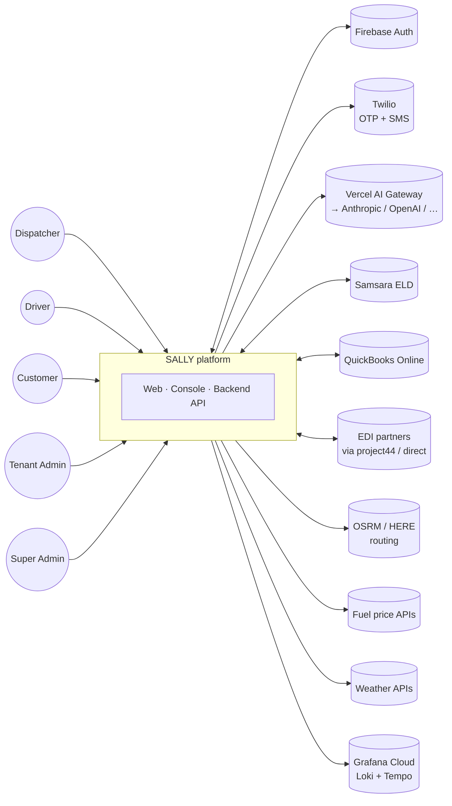
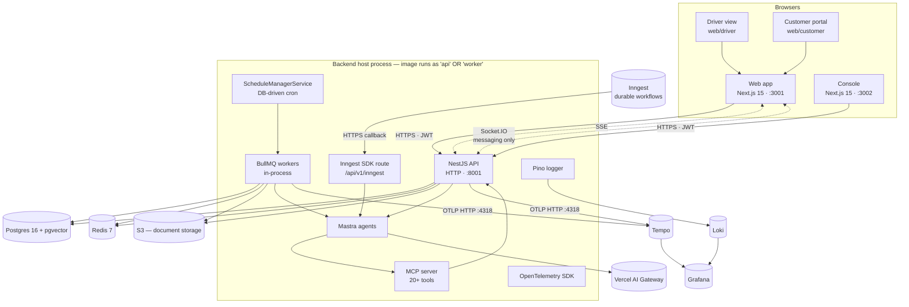
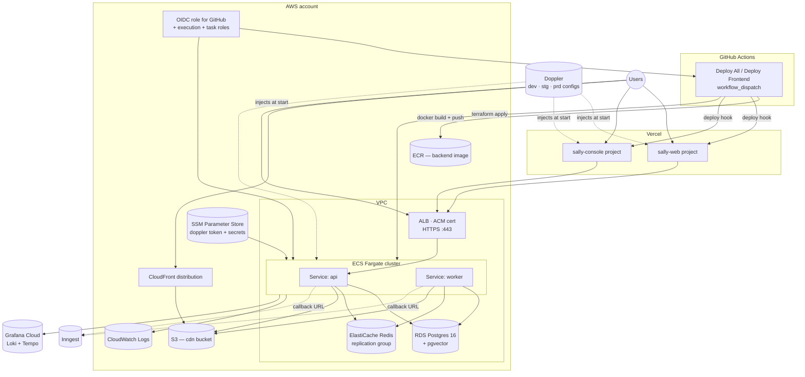
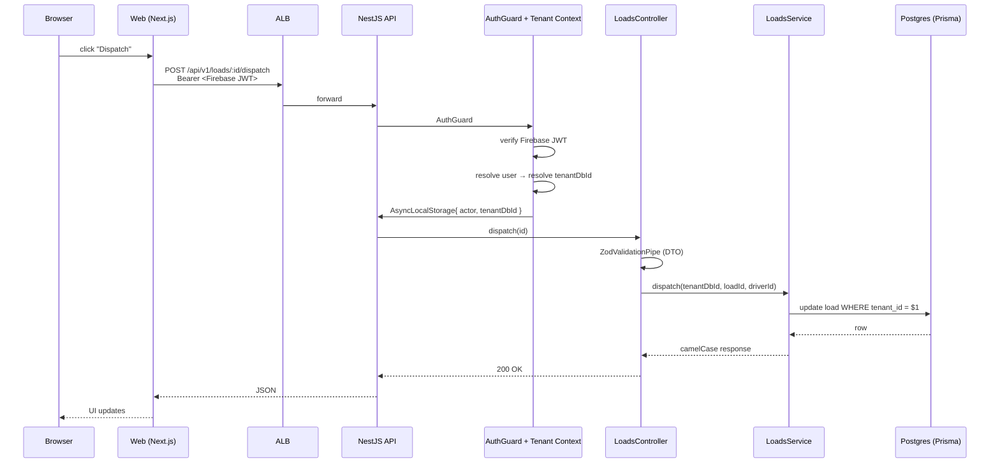
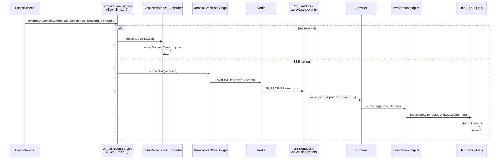
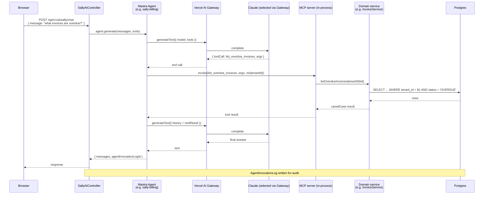
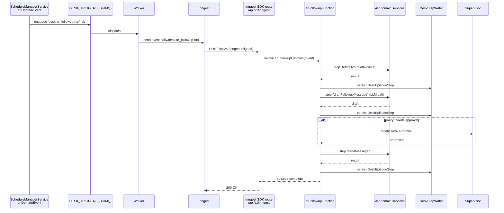
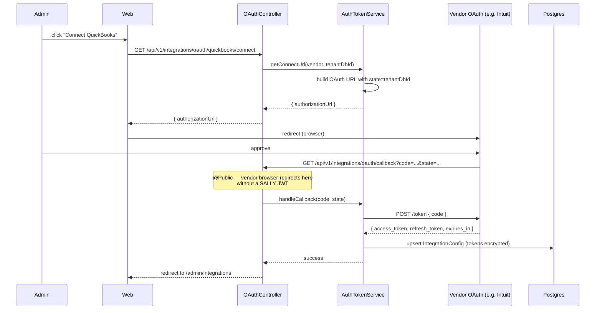
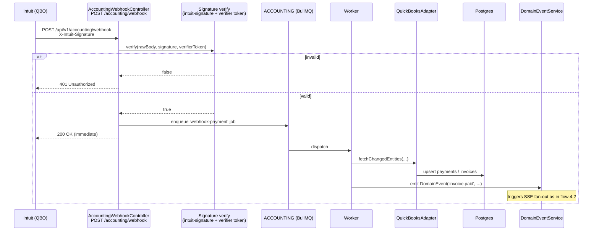

# Runtime Architecture

This is the one-page visual reference. Three static views (system context, containers, deployment) then sequence diagrams for the flows you'll trace most often.

Each diagram has a **Source** line — the file paths the picture was drawn from. When the picture stops matching the code, the source line is where you start the refresh.

---

## 1. System context

Who SALLY talks to and who talks to SALLY. Useful when explaining the platform to a partner, a security reviewer, or a new engineer in their first 30 seconds.

**Source:** `apps/backend/src/domains/integrations/`, `apps/backend/src/domains/ai/infrastructure/providers/ai-provider.ts`, `apps/backend/src/domains/platform-services/`.

---

## 2. Containers

What runs inside SALLY and how they connect. This is the "internal organs" diagram — every component a backend or frontend developer touches is here.

**Notes:**

- `api` and `workers` are the **same Docker image** but run as two ECS services with different commands. API serves HTTP; workers run BullMQ + scheduled jobs.
- MCP server runs inside the backend process and is also called by Mastra inline (no network hop for tool invocations).
- Inngest is external — the backend exposes a callback URL Inngest hits.
- Observability (Loki + Tempo + Grafana) is opt-in locally and managed in production.

**Source:** `infra/terraform/ecs.tf` (api + worker task definitions), `apps/backend/src/domains/ai/sally-ai/mastra/`, `apps/backend/src/domains/ai/mcp-server/`, `apps/backend/src/domains/desk/core/inngest/inngest.controller.ts`, `apps/backend/src/infrastructure/telemetry/telemetry.ts`, `apps/backend/src/infrastructure/logging/pino-transport.ts`.

---

## 3. Deployment topology

Where each container actually runs in production.

**Notes:**

- Backend lives on AWS (ECS Fargate); frontend on Vercel. Both deploys are triggered manually via GitHub Actions (`workflow_dispatch` — no automatic git-push deploy).
- `api` and `worker` are two ECS services from the same image, sharing RDS, ElastiCache, and S3.
- Doppler injects secrets at container start in every environment.
- Vercel uses **deploy hooks** from the workflow — `vercel.json` has `deploymentEnabled: false` to disable git auto-deploy.
- Observability ships to Grafana Cloud in production; locally it's the opt-in Docker profile.

**Source:** `infra/terraform/{ecs,rds,elasticache,alb,cdn,s3,ecr,iam,doppler,cloudwatch}.tf`, `.github/workflows/deploy-all.yml`, `.github/workflows/deploy-frontend.yml`, `vercel.json`, `apps/web/vercel.json`, `apps/console/vercel.json`.

---

## 4. Sequence flows

Six flows — the critical ones every backend developer ends up tracing. Each is a self-contained Mermaid block; read whichever you need.

### 4.1 Authenticated API request

A dispatcher clicks "dispatch this load" in the web app. This is the request shape every endpoint follows.

**What this shows:** the camelCase boundary (Prisma takes snake_case, the response is camelCase), `tenantDbId` resolved by the guard chain not the controller, validation as a pipe.

**Source:** `apps/backend/src/auth/`, `apps/backend/src/shared/base/base-tenant.controller.ts`, `apps/backend/src/infrastructure/events/event-context.interceptor.ts`, any controller under `apps/backend/src/domains/fleet/loads/controllers/`.

### 4.2 Write → DomainEvent → SSE → frontend invalidation

The same dispatch action, continued. **This is the spine of how real-time works in SALLY.**

**What this shows:** one emit fans out to three things — durable log, SSE to browsers in the same tenant, and (if registered) BullMQ-backed durable subscribers. The wildcard subscriber rule matters here: a plain-object emit would skip both `Persist` and `SSEBridge`.

**Source:** `apps/backend/src/infrastructure/events/{domain-event.ts,event-bus.module.ts,event-persistence.subscriber.ts}`, `apps/backend/src/infrastructure/sse/domain-event-sse-bridge.service.ts`, `apps/web/src/shared/realtime/{sse-bus.ts,sse-context.tsx,invalidation-map.ts}`.

### 4.3 AI agent invocation (Mastra + MCP)

User asks Sally a question. Mastra picks an agent, the model returns a tool call, MCP executes against the domain layer, the answer comes back. This is where AI Gateway, MCP, and the domain code meet.

**What this shows:** the Gateway is the only path to the model (no provider SDK bypass). MCP tools are in-process function calls, not network calls. Every tool execution respects the active tenant via the context the MCP server passes down.

**Source:** `apps/backend/src/domains/ai/sally-ai/`, `apps/backend/src/domains/ai/sally-ai/mastra/mastra.provider.ts`, `apps/backend/src/domains/ai/mcp-server/`, `apps/backend/src/domains/ai/infrastructure/providers/ai-provider.ts`.

### 4.4 Inngest-backed Desk episode

A scheduled responsibility — currently AR follow-up — fires, runs through steps, and either resolves or escalates to a supervisor. This is what makes the Desk runtime durable: each step is a checkpoint, retries are automatic, and a deploy mid-episode doesn't lose state.

**What this shows:** each `step` is one durable checkpoint. If the backend restarts between steps 2 and 3, Inngest replays from step 3 — not from scratch. Approvals pause the episode until a supervisor action arrives via the API.

**Source:** `apps/backend/src/domains/desk/core/inngest/{inngest.controller.ts,inngest.client.ts}`, `apps/backend/src/domains/desk/responsibilities/ar-followup/workflow/ar-followup.function.ts`, `apps/backend/src/infrastructure/queue/schedule-manager.service.ts`.

### 4.5 OAuth connect (a vendor like QuickBooks)

An admin clicks "Connect QuickBooks." The OAuth dance, with the redirect coming back to a public endpoint.

**What this shows:** the callback is `@Public` because the vendor's browser redirect doesn't carry a SALLY JWT. State carries the `tenantDbId` so the callback can scope correctly. Tokens are stored encrypted in `IntegrationConfig`.

**Source:** `apps/backend/src/domains/integrations/oauth/{oauth.controller.ts,auth-token.service.ts}`, `apps/backend/src/domains/integrations/vendor-registry.ts`.

### 4.6 Inbound webhook (QuickBooks CDC)

A change happens in QuickBooks. Intuit calls our webhook. We verify the signature, enqueue a sync job, return immediately, and process asynchronously.

**What this shows:** webhook handlers acknowledge fast (200 OK) and do the actual work on a queue. Signature verification is mandatory and happens in the controller before anything else.

**Source:** `apps/backend/src/domains/integrations/accounting/controllers/accounting-webhook.controller.ts`, `apps/backend/src/domains/integrations/accounting/`, `apps/backend/src/infrastructure/queue/queue.constants.ts`.

---

## What's not on this page

- **Per-domain business logic.** This page is the shape. Domain pages (see [Backend Architecture](backend.md)) cover what each service does.
- **Schema-level data structure.** [Data Model](data-model.md) covers the 131 Prisma models.
- **The full AI stack rules and exceptions.** [AI Stack](ai-stack.md) has the Mastra-default rule plus the documented direct-AI-SDK exceptions.
- **The Desk vocabulary and runtime model.** [Sally's Desk](sally-desk.md).
- **The observability "what to look at for what" reference.** [Observability](observability.md).

## Further reading

- [System Overview](index.md) — the brief written summary that complements these diagrams.
- [Backend Architecture](backend.md) — module-by-module breakdown.
- [Frontend Architecture](frontend.md) — App Router, state stack, real-time wiring.
- [Backend → Events & Queues](../backend/events-queues.md) — DomainEvent + BullMQ in detail.
