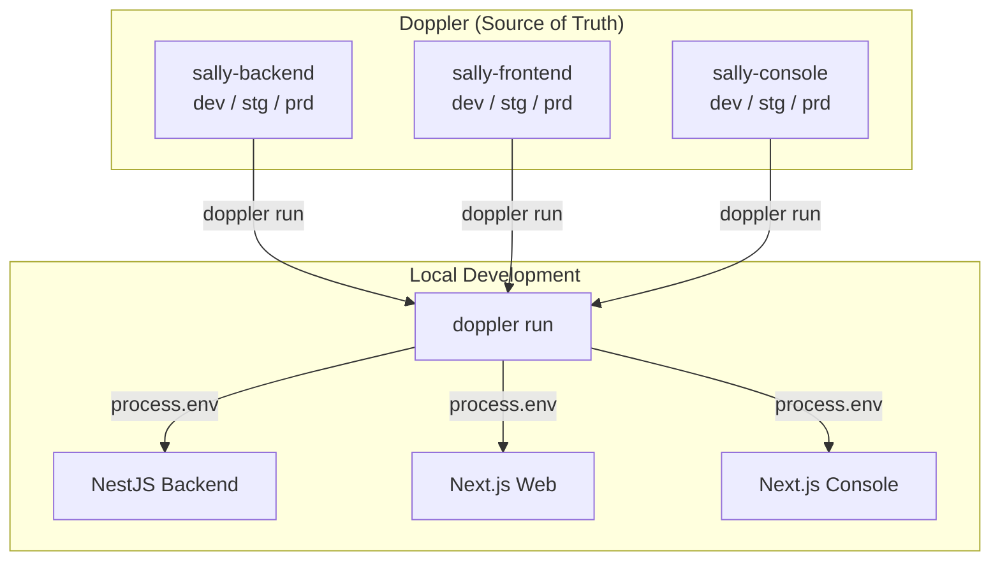

# Secrets Management

SALLY uses [Doppler](https://www.doppler.com/) as the single source of truth for all environment variables and secrets across every environment. No `.env` files are committed; Doppler injects everything at runtime.

> **First-time setup:** see [Getting Started → Environment Setup](../getting-started/environment-setup.md#3-authenticate-with-doppler) for the per-app `doppler setup` flow.
> **Daily use:** `pnpm doppler:backend`, `pnpm doppler:frontend`, `pnpm doppler:console` — these wrap `doppler run -- pnpm run dev` in each app folder.

## Architecture



## Doppler Projects

| Project | App | Configs | Secret Count |
|---------|-----|---------|-------------|
| `sally-backend` | NestJS API | dev, stg, prd | ~85 vars |
| `sally-frontend` | Next.js web | dev, stg, prd | ~16 vars |
| `sally-console` | Next.js console | dev, stg, prd | ~13 vars |

Each project has three configs that map to environments:

- **dev** — Local development. Points to `localhost` Postgres/Redis.
- **stg** — Staging. Points to AWS RDS/ElastiCache staging instances.
- **prd** — Production. Points to AWS RDS/ElastiCache production instances.

## How It Works

### Local Development

Each app directory has a `doppler.yaml` that declares its project and default config:

```yaml
# apps/backend/doppler.yaml
setup:
  project: sally-backend
  config: dev
```

After running `doppler setup` once, `doppler run` in that directory automatically fetches the correct secrets:

```bash
# These are equivalent:
pnpm doppler:backend
cd apps/backend && doppler run -- pnpm run dev
```

### Staging & Production

ECS containers use `doppler run` as the entrypoint. A Doppler service token (`DOPPLER_TOKEN`) is passed as an environment variable in the ECS task definition. At container startup, `doppler run` fetches all env vars from the correct Doppler config and injects them into `process.env` before starting `node dist/main`.

No AWS Secrets Manager is used — Doppler is the only secrets store.

### Adding a New Environment Variable

1. **Add to `.env.example`** — with a placeholder value and comment
2. **Add to Doppler** — set real values in the [dashboard](https://dashboard.doppler.com) for all 3 configs (dev, stg, prd)
3. **Add to `configuration.ts`** — if it's a backend var, add the Zod schema entry in `apps/backend/src/config/configuration.ts`

No Terraform or ECS changes needed — Doppler injects all env vars at container startup.

### Removing an Environment Variable

1. Remove from `.env.example`
2. Remove from Doppler (all configs)
3. Remove from `configuration.ts` if applicable

## Secret Categories

| Category | Example Keys | Notes |
|----------|-------------|-------|
| Database & Cache | `DATABASE_URL`, `REDIS_URL` | Different per environment |
| JWT | `JWT_ACCESS_SECRET`, `JWT_REFRESH_SECRET`, `SECRET_KEY` | Unique per environment |
| Firebase | `FIREBASE_PRIVATE_KEY`, `FIREBASE_CLIENT_EMAIL` | Same across all envs |
| AI | `AI_GATEWAY_API_KEY`, `OPENAI_API_KEY` | May differ dev vs prod |
| Integrations | `TWILIO_*`, `SAMSARA_*`, `QUICKBOOKS_*`, `HERE_*` | Sandbox keys in dev/stg |
| Voice | `LIVEKIT_*`, `DEEPGRAM_*`, `CARTESIA_*` | Same across all envs |
| Billing | `STRIPE_SECRET_KEY`, `STRIPE_WEBHOOK_SECRET` | Test keys in dev/stg |
| Email | `RESEND_API_KEY` | Empty in dev (console mode) |
| Observability | `LANGFUSE_SECRET_KEY`, `LANGFUSE_PUBLIC_KEY` | Same across all envs |

## Config Validation

The backend validates all environment variables at boot via a Zod schema in `apps/backend/src/config/configuration.ts`. If a required variable is missing, the app fails fast with a clear error message.

This works identically whether secrets come from Doppler, `.env.local`, or ECS task definitions — they all end up in `process.env`.

## Deployment Setup (One-Time)

ECS containers and GitHub Actions need **Doppler service tokens** to fetch secrets at runtime. These are created in the Doppler dashboard and stored in GitHub.

### Creating Service Tokens

1. Go to [Doppler Dashboard](https://dashboard.doppler.com) → **sally-backend** → **stg** config
2. Click **Access** tab → **Generate Service Token**
3. Name it `ecs-staging`, copy the token (starts with `dp.st.`)
4. Repeat for **prd** config → name it `ecs-production`

### Adding to GitHub

Add these as GitHub repository secrets (Settings → Secrets and variables → Actions):

| GitHub Secret | Doppler Source |
|---------------|---------------|
| `DOPPLER_TOKEN_STG` | sally-backend / stg service token |
| `DOPPLER_TOKEN_PRD` | sally-backend / prd service token |

### Vercel Sync (Frontend)

To auto-sync `NEXT_PUBLIC_*` vars to Vercel:

1. Go to [Doppler Dashboard](https://dashboard.doppler.com) → **Integrations** → **Vercel**
2. Connect your Vercel account
3. Map `sally-frontend/stg` → Vercel `sally-staging` project (Preview)
4. Map `sally-frontend/prd` → Vercel `sally-staging` project (Production)
5. Repeat for `sally-console`

## Security

- **Doppler dashboard** — access controlled by team membership in the `appshore` workspace
- **Service tokens** — scoped to a single project + config (e.g., `sally-backend/prd`), stored in SSM Parameter Store (SecureString) for ECS
- **Audit log** — Doppler tracks who accessed or changed every secret
- **No secrets in code** — `doppler.yaml` contains only project/config names, never values
- **`.doppler.yaml`** (user-specific overrides) is gitignored
- **Fallback file** — `doppler run --fallback` caches an encrypted snapshot for outage resilience
